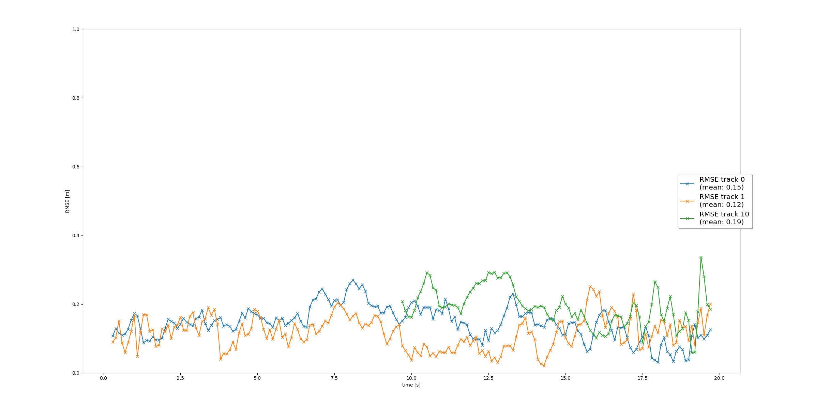
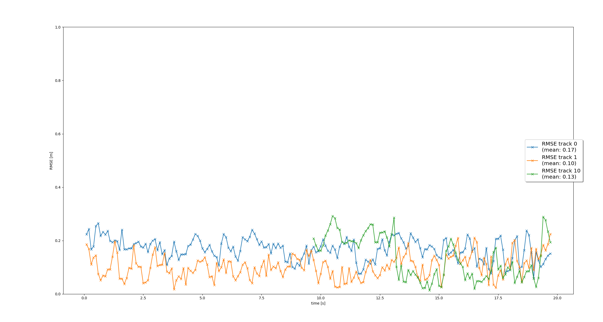

# Writeup: Track 3D-Objects Over Time

### 1. Write a short recap of the four tracking steps and what you implemented there (filter, track management, association, camera fusion). Which results did you achieve? Which part of the project was most difficult for you to complete, and why?

### Step1: implement an EKF to track a single real-world target with lidar measurement.
The core of this step was the implementation of a Linear Kalman filter.
The state of the filter is composed by 6 state (i.e. the vehicle [x,y,z,vx,vy,vz]).
The prediction step is based on a simple linear constant speed motion model
and the acceleration are considered as process noise.
The update step integrates Lidar detection. The lidar detection has a linear
model since it measure directly the [x,y,z] position of the object.

### Step2: the track management to initialize and delete tracks.
There is not a perfect detection algorithms. From a safety point of
view we want as low false negative as possible (i.e. we do not want to
miss any obstacle). This comes at the price of false positive.
Track management aims at eliminating false positive with a simple
mechanism that confirms a tack (detection) only if it is detected
in different frames consecutive frames.

### Step3: single nearest neighbor data association.
To associate the measurements to the active tracks a nearest neighbor
data association is applied. To measure the distance between the
measure and the track we consider the detection uncertainty by using
the Mahalanobis distance. Despite more complicated technique
can be implemented it was surprising how good this technique performed
in the provided test case.

### Step4: extend EKF with nonlinear camera measurement mode.
In this final step we added to the Kalman Filter an update step that can work with the camera
measurement mode. This update step involving the projection operation is nonlinear
and we have to compute the H matrix by deriving the measurement model making
our filter enter the Extended Kalman Filters family.

### 2. Do you see any benefits in camera-lidar fusion compared to lidar-only tracking (in theory and in your concrete results)?
Autonomous car should prioritize safety. The laser based object detection pipeline
and the camera based object detection pipelines are separated system with
different measurements principle, different detection system architecture, different
training data. We expect their failures to be independent. Therefore, by
a proper fusion strategy it is possible to obtain a system with less failure
than the 2 sensors taken alone.
Nevertheless when 2 system are measuring the same quantity a proper filter strategy
can lead to a smaller measurement error. This can be confirmed by comparing
the RMSE obtained when using only the lidear and when using camera+lidar:
|    lidar          |  lidar+camera |
:-------------------------:|:-------------------------:
  |  

|track | lidar RMSE [m] |  lidar+camera RMSE [m] |
:-----:|:--------------:|:-----------------------:
0 | 0.15  |  0.17
1 | 0.12  |  0.10
2 | 0.19  |  0.13

We can see that the detection improved sensibly for track 1 and 2 but it decreased of 2 cm in track 0.
This can probably explained considering that we never enforced
the camera tracking to detect the same center of the lidar tracking
system. A small inconsistency in the center measurements can make the estimations from the 2 sensor to fight a bit with each other.
This effect is less visible more the cars get closer to the center of the image.
When the car are closer to the center of the image both the camera and the laser
see the car trunk as a square and the center computation gives more similar
result. Instead when we see a big part of the side of the car the error might
be bigger.

But the most important improvement is that the peaks in the RMSE plot are dampened
confirming a more robust behavior of the system when integrating measurements
from multiple sources.

### 3. Which challenges will a sensor fusion system face in real-life scenarios? Did you see any of these challenges in the project?
Sensor calibration is always a major concern. Miscalibrated sensors can give
a estimations that fight with each others.
The EKF will just average the estimations and will produce a wrong estimation.
Detecting sensor miscalibration and correcting it is crucial but
a really challenging task.
On the same line also faulty or not synchronized sensors can be difficult to
spot and can create lots of problem.
Finally usually sensors are connected trough a network and it is not always
guarantee that our pipeline will receive the sensor messages in the correct
order.

### 4. Can you think of ways to improve your tracking results in the future?
- Running the current software on the sample data, it can be clearly see we have
a bad and jumping yaw estimation of track 10 when it gets closer to track 0.
This happens because at the moment we use a simple constant velocity model and
we add apply the same measurement noise to change in velocity along x,y,z.
The vehicle can not fly and cannot move laterally. This constraints can be
better reflected by using a unicycle model for predicting the vehicles motions.
By using the unicycle model we will add a stronger filtering to sudden change
of heading direction of the vehicle, resulting in a smoother and closer
to real estimated trajectory.

- The detection pipelines are not guarantee to measure the same center of the
object. Characterizing the offset between the different estimation and
integrating it in the measurements update will lead to better results.

